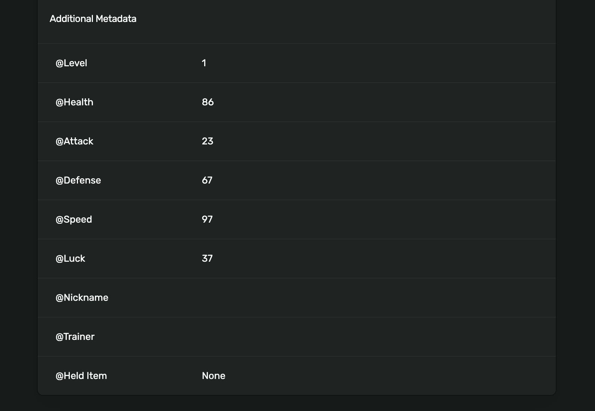

# onchain-traits

`onchain-traits` is a solana naming convention and a standard of defining onchain traits using the token extension with additional_metadata.

## 1/ The Issue

- Non-Fungible Tokens (NFTs) and Fungible Tokens (FTs) have a fundamental difference in their trait systems. NFTs are unique, with each item having its own set of unique attributes.
- Previously, the ERC404 or SPL404 standards introduce the conversion of FTs to NFTs and vice versa. However, the current conversion process relies on a First-In-First-Out (FIFO) queue, which is random, and lacks differentiation in the conversion rate based on rarity (e.g., 1000 for common, 5000 for rare).
- Introducing on-chain traits for NFTs opens up new possibilities for trading them differently from fungible tokens:
    - Different on-chain royalties based on the on-chain traits
    - Different fee tiers for trading based on the on-chain traits
    - Different conversion rates of FT ↔ NFT for 404 standards and hybrid trading based on the on-chain traits
    - Different loan terms based on the on-chain traits
    - Building collection offers for rare items within a collection, targeting specific trait combinations rather than just the entire collection.

## 2/ Proposed Solutions

Within the token22 TokenMetadata, following a naming convention, the on-chain traits can be fully compatible with any token22 standard, including token22 vanilla, token22 Metaplex, and token22 WNS.

```rust
pub struct TokenMetadata {
    /// ...

    /// Any additional metadata about the token as key-value pairs. The program
    /// must avoid storing the same key twice.
    pub additional_metadata: Vec<(String, String)>,
}
```

We can directly store trait key-value pairs into the `additional_metadata` field with the convention of the prefix `@` to annotate the fields to be `onchain-traits`.

```rust
additional_metadata: [("@attr1", "val1"), ("@attr2", "val2"), ("@attr2", "val2")]
```

For example:



We enforce a naming convention like `@attr1` to differentiate trait key-value pairs from other common key-value pairs. Based on this naming convention, we can have 1) an indexing system and 2) on-chain programs to start parsing the on-chain traits and build smart contracts based on these naming rules.

